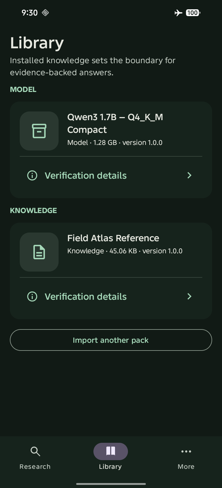

# Current Field Atlas Reference build

This page is the review hub for the functional Field Atlas `1.1.6` build. The APK is the signed release linked from the [installation guide](../../installation.md), and the source is pinned by the public `main` history.

## Real-device check

On 2026-09-24, the signed `xyz.fieldatlas` package was installed on an Infinix SMART 20 / X6840 running Android 16 (API 36), ARM64. The app launched with radios disabled. The bundled Reference pack migrated into app-private storage automatically; no knowledge-pack import was required.

The Library screen shows the installed model and `Field Atlas Reference · 45.06 KB · version 1.0.0`. The Reference pack contains twelve CC0 project-authored notes covering seasons, water, solar storage, evidence comparison, Formula One, cars, batteries, climate, computing, networks, health information, and history. Its scope is focused, not encyclopedia-complete.

## Public demo

The existing public Farcaster post is [Field Atlas offline Android demo](https://farcaster.xyz/0x94t3z.eth/0x9538cba8). The repository also contains the complete raw recording and supporting frames in [the physical-device record](../physical/infinix-x6840-android16/README.md).

That recording predates the Reference-pack migration and is retained as historical offline proof. The screenshot above is current-build evidence. The repository does not label the historical recording as a demonstration of the new Reference corpus.

## Review boundary

Field Atlas answers without a local match using the on-device model, but those answers are explicitly uncited. Numbered, clickable citations are only created from passages present in an installed knowledge pack. This distinction is deliberate: model training is not an inspectable source.
