# Field Atlas 1.1.1 physical-device record

Initial capture was made on 2026-09-22 from a USB-paired Infinix SMART 20 / X6840 running Android 16 (API 36), ARM64, with follow-up multi-query evidence captured on 2026-09-23. The device reported `Infinix X6840`; the signed installed package was `xyz.fieldatlas` version 1.1.1 (`versionCode` 4).

## Exact tested artifact

- Signed APK: 49,143,558 bytes.
- SHA-256: `6ffdc71cba6543e57adbdb4d2c51b6866a7e941d754108b1344216830b1936fa`.
- Offline APK audit: passed.
- Model: Qwen3 1.7B Q4_K_M Compact, 1.28 GB.
- Knowledge pack: Field Atlas Starter Evidence, 24.58 KB.

The recorded package version, APK checksum, Android release, and airplane-mode state are retained as adjacent text files.

The installed base APK was pulled back from the connected device on 2026-09-23 and matched the public release byte-for-byte at SHA-256 `6ffdc71cba6543e57adbdb4d2c51b6866a7e941d754108b1344216830b1936fa`.

## Radios-off run

Airplane mode was enabled and Wi-Fi and mobile data were disabled before launching the app. The installed model and knowledge pack were used to answer “Why do Earth's hemispheres have opposite seasons?” locally. The resulting answer displays the offline state and mapped local citations.

### Research home · light theme

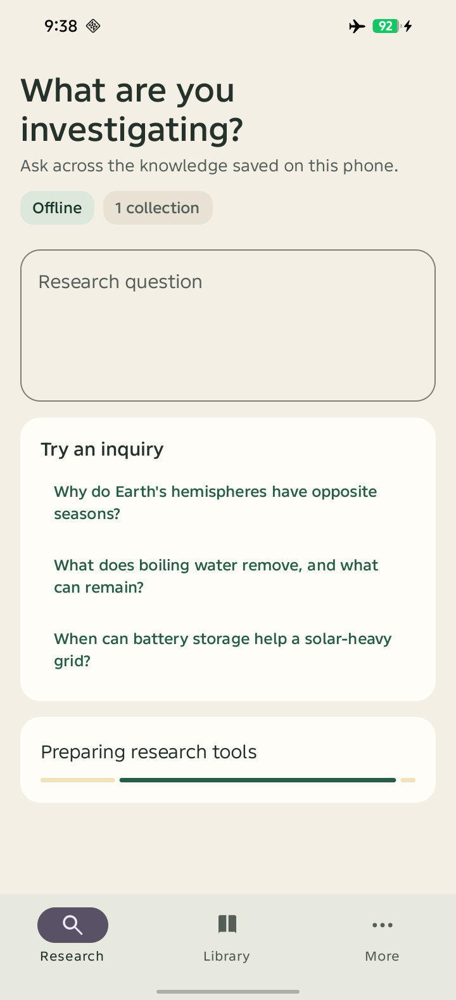

### Installed local assets

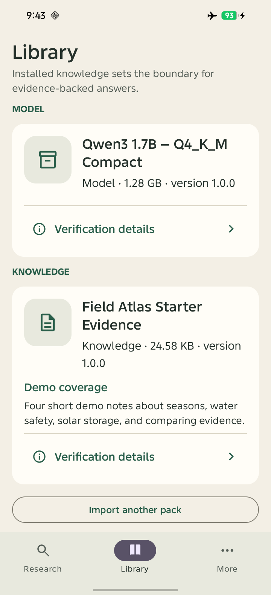

### Cited offline answer

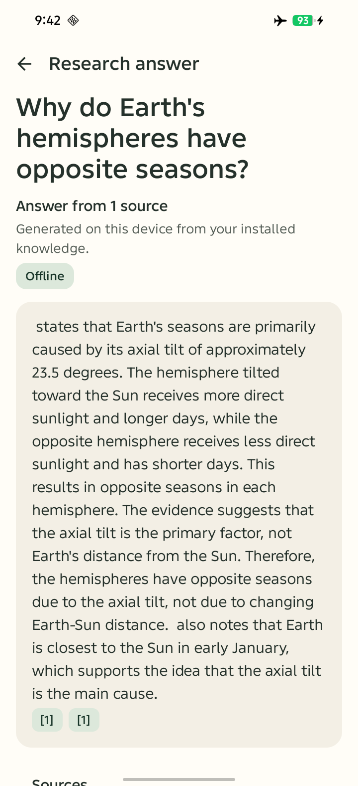

### Research home · dark theme

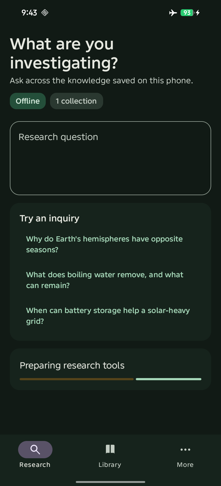

## Memory observation

`current-app-meminfo.txt` records a 2,099,224 KiB total PSS observation for the loaded current app process. This is about 2.0 GiB, below the 12 GB environment ceiling. It is a field observation, not a performance guarantee.

## Video

<video src="field-atlas-current-demo.mp4" controls width="720">
  <a href="field-atlas-current-demo.mp4">Play the complete physical-device demo</a>
</video>

The complete recording is a 46.97-second 1920 × 1080 H.264 demo from the current Infinix run. It shows the current Field Atlas branding, offline research flow, installed local model and knowledge pack, radios-off operation, the seasons question, local answer generation, cited answer, and local grounding. Select the animated preview if the video player is unavailable.

### Demo overview

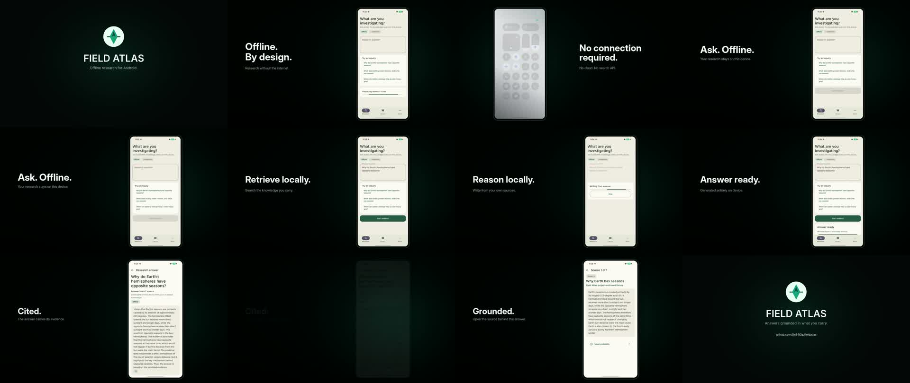

## Additional multi-query evidence

These follow-up runs used the same installed signed APK, local Qwen model, starter knowledge pack, airplane mode, and disabled Wi-Fi. The raw portrait recordings retain the real inference wait rather than replacing it with simulated output.

### Water-treatment limitation

Question: “What does boiling water remove, and what can remain?”

<video src="water-safety-proof.mp4" controls width="360">
  <a href="water-safety-proof.mp4">Play the 87.65-second raw water-safety run</a>
</video>

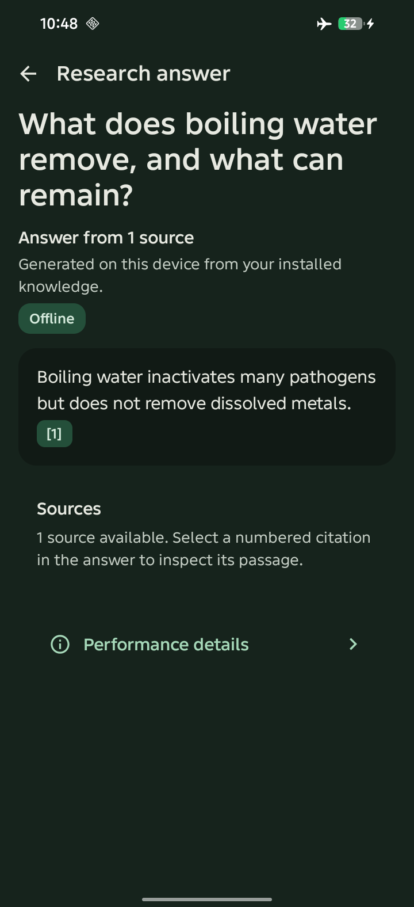

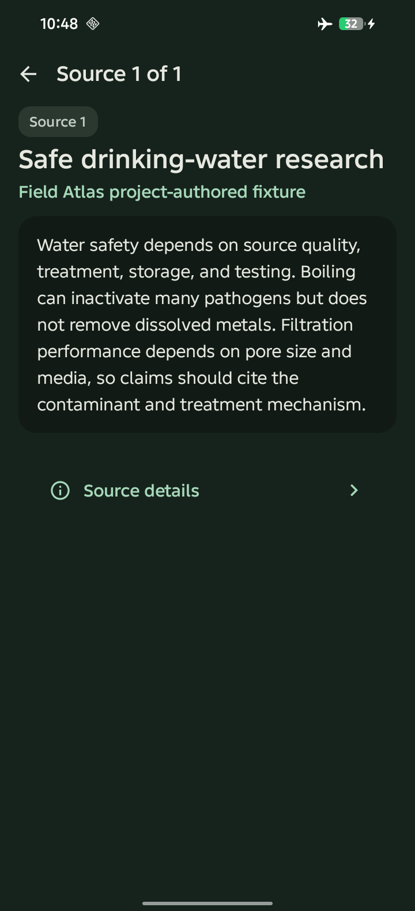

### Solar-storage reasoning

Question: “When can battery storage help a solar-heavy grid?”

<video src="solar-storage-proof.mp4" controls width="360">
  <a href="solar-storage-proof.mp4">Play the 96.69-second raw solar-storage run</a>
</video>

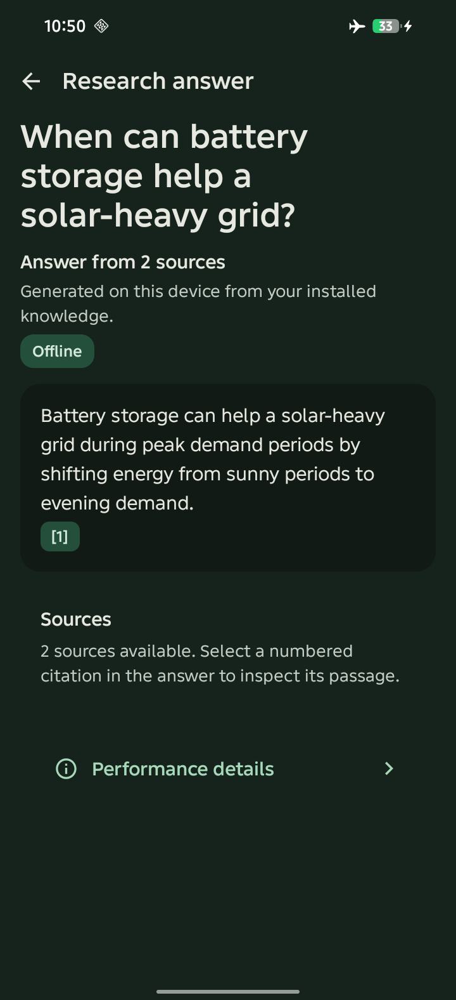

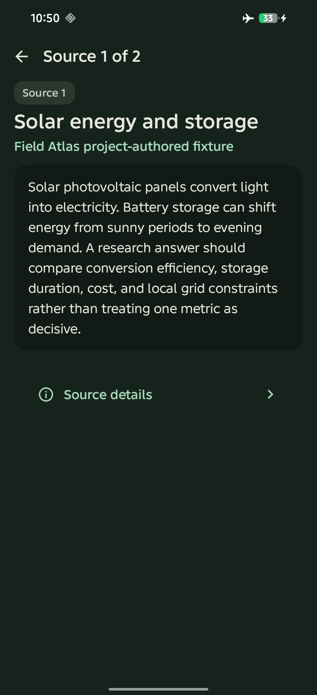

### Cross-source comparison and synthesis

Question: “Compare boiling and filtration for water that may contain pathogens and dissolved metals, then explain what evidence must be checked before recommending treatment.”

<video src="cross-source-water-proof.mp4" controls width="360">
  <a href="cross-source-water-proof.mp4">Play the 170.32-second raw cross-source run</a>
</video>

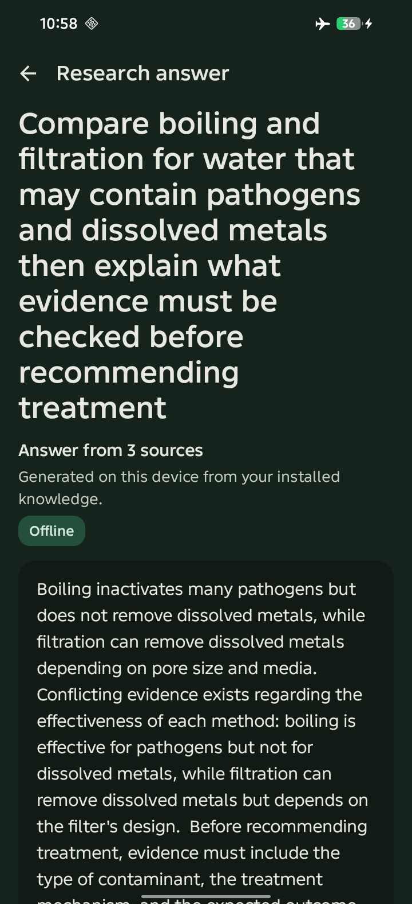

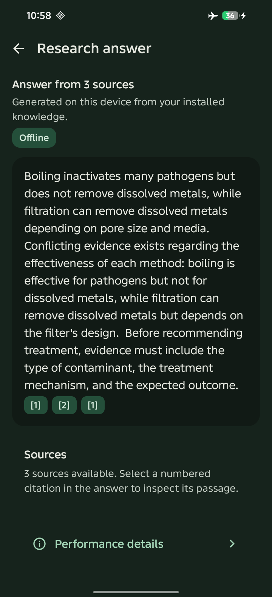

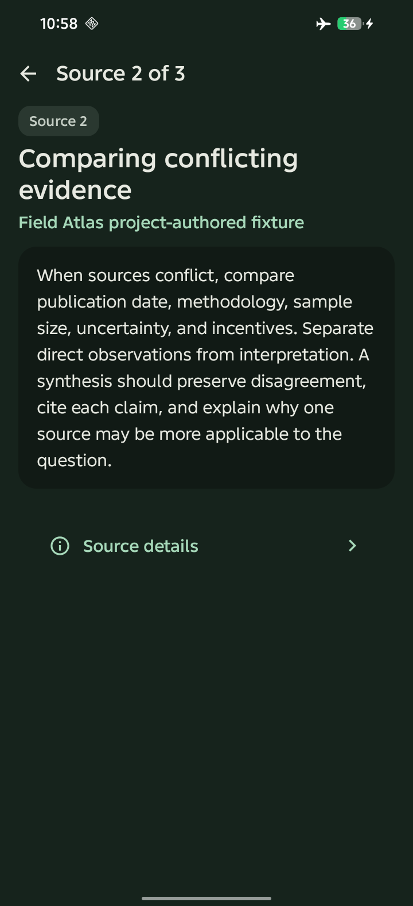

This record demonstrates installation, local execution, offline mode, local source attribution, and the current visual build on one physical Android device. It does not represent GrapheneOS testing or an independent assessment of the bounty's quality bar.

Public proof: [Farcaster](https://farcaster.xyz/0x94t3z.eth/0x9538cba8).
